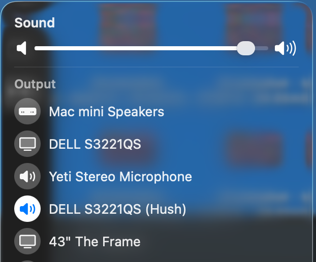

<h1 align="center">Hush</h1>

Your Mac’s volume controls, for your monitor.

Can’t change your monitor’s volume from your Mac? Hush lets you use your keyboard’s volume keys and the macOS Sound slider.

**[Download Hush](https://github.com/dared66/hush/releases/latest/download/Hush.pkg)** · Free and open source · macOS 14.4+ · Apple silicon & Intel

## Get started

1. Download and open **Hush.pkg**. Follow the installer and enter your Mac password when asked.
2. Open **Control Center → Sound** and select your monitor’s **(Hush)** output.
3. Use your volume keys or the Sound slider. That’s it.

Hush starts automatically when you log in. There’s no extra volume slider to manage.

Pause music or calls before installing—audio restarts briefly.

## If macOS blocks the installer

Hush isn’t notarized by Apple yet. If you see an unidentified-developer warning, open **System Settings → Privacy & Security → Open Anyway** for Hush, then continue the installer.

Only approve a download you trust. For a damaged-file or malware warning, or if that option is missing, see [installation help](docs/INSTALLATION.md).

## Uninstall

Open **Hush** from Applications and click **Uninstall Hush…**. Use this instead of dragging the app to Trash so its audio driver is removed too. Pause playback first; your monitor returns to its hardware volume.

---

Hush is experimental, with limited hardware testing. [Compatibility and installation help](docs/INSTALLATION.md) · [Report a problem](https://github.com/dared66/hush/issues)

Want to contribute? See [Contributing](CONTRIBUTING.md). Hush is [MIT licensed](LICENSE), with [third-party notices](THIRD_PARTY_NOTICES.md).
